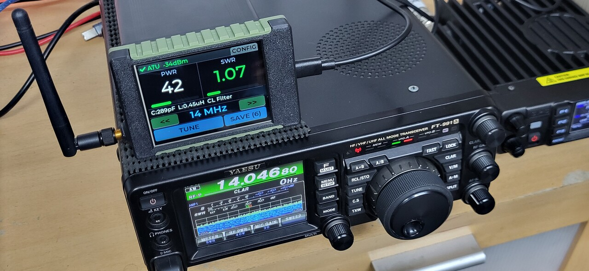
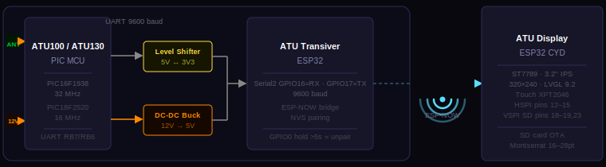
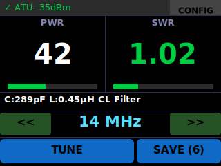
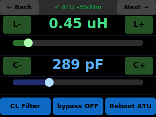
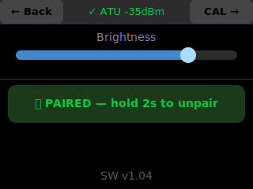
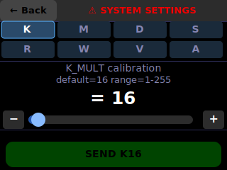

# ATU Remote Control System

> HF antenna tuner upgrade — wireless remote control, real-time PWR/SWR telemetry, manual L/C tuning and full touch GUI for ATU100/ATU130.



> More photos available in the [Photo](Photo/) folder.

---

## System Architecture



---

## GUI Screens

| MAIN | CONFIG | BRIGHTNESS | SYSTEM SETTINGS |
|:---:|:---:|:---:|:---:|
|  |  |  |  |

---

## About

This system is an upgrade for the existing [ATU100/ATU130](https://github.com/Dfinitski/N7DDC-ATU-100-mini-and-extended-boards) antenna tuners by N7DDC. In their original form these tuners have no band memory, no manual L/C fine-tuning, no remote control interface and no way to be positioned at the antenna feed point — since in that case there is no control interface and no way to monitor PWR and SWR. This project adds:

- **Wireless remote control** via ESP-NOW
- **Real-time PWR and SWR telemetry** on the display
- **30 memory slots** (11 currently in use — one per amateur band)
- **Full touch GUI** — manual L/C adjustment, relay visualisation, cal parameter editing
- **SD card OTA** firmware update

---

## Hardware

| Component | Details |
|-----------|---------|
| ATU100 MCU | PIC16F1938 · 32 MHz (8M × 4xPLL) |
| ATU130 MCU | PIC18F2520 · 16 MHz (4M × 4xPLL) |
| UART link (PIC) | 9600 baud · TX=RB7 · RX=RB6 · IOC interrupt · circular buffer |
| EEPROM | 256 bytes · 8 cal params · 30 relay slots (3 bytes each) |
| Transiver MCU | ESP32 |
| UART link (ESP32) | Serial2 · GPIO16=RX · GPIO17=TX · 9600 baud |
| Interface | DC-DC 12V→5V Buck mini · 3V3↔5V level shifter (UART logic level coupling) |
| Pairing | ESP-NOW · NVS MAC persistence · GPIO0 hold >5s to unpair |
| Display MCU | ESP32 CYD · HSPI (pins 12–15) · VSPI SD (pins 18–19,23) |
| Display panel | ST7789 · 3.2″ IPS · 320×240 · backlight PWM GPIO27 |
| Touch controller | XPT2046 · shared HSPI · CS=GPIO33 |
| GUI framework | LVGL 9.2 · Montserrat SemiBold 16/20/24/28 pt |
| Power | 12V DC |

---

## ESP-NOW Protocol

Packet format: `[0xAA][TYPE][payload...]`

| Type | Direction | Payload |
|------|-----------|---------|
| `0x01` `$PWR` | ATU → Display | `power,swr,ind_hex,cap_hex,sw` |
| `0x02` `$CAL` | ATU → Display | all cal params + relay state |
| `0x03` CMD | Display → ATU | command string |
| `0x04` `$TUNE` | ATU → Display | tuning status code (0–15) |
| `0x05` ANN | both | pairing announce, 6-byte MAC |

> SWR is transmitted as `int × 100` (e.g., 125 = 1.25).

---

## ATU Commands

| Command | Description |
|---------|-------------|
| `tune\r` | Start autotune |
| `r{slot}\r` | Recall relay slot (1–30) |
| `s{slot}\r` | Save current L/C/SW to slot |
| `L{7bit}\r` | Set inductors (MSB=4.5 µH, LSB=0.05 µH) |
| `C{8bit}\r` | Set capacitors (MSB=1000 pF, LSB=Cap_sw) |
| `reset\r` | All relays off (bypass) |
| `cal\r` | Request calibration data |
| `K/M/D/S/R/W/V/A {val}\r` | Set calibration parameters |

---

## Getting Started

### Requirements

- **ATU100 / ATU130:** MPLAB X IDE, XC8 compiler, PICkit programmer
- **ATU_transiver / ATU_display:** Arduino IDE 2.x, ESP32 board package

### Libraries (ATU_display)

```
LVGL 9.2
TFT_eSPI
XPT2046_Touchscreen
SD (built-in)
```

### Flash Instructions

1. **ATU100 or ATU130** — open `ATU100_NEW/` or `ATU130_NEW/` in MPLAB X, build and flash via PICkit
2. **ATU_transiver** — open `ATU_transiver/ATU_transiver.ino` in Arduino IDE, select board *ESP32 Dev Module*, flash
3. **ATU_display** — open `ATU_display/ATU_display.ino`, select board *ESP32 Dev Module*, flash

### First Boot — Pairing

1. Power on **ATU_transiver** — it broadcasts pairing announcements every 2 s
2. Power on **ATU Display** — it detects the announcement and shows a pairing confirmation dialog; confirm to save the peer MAC to NVS
3. Both devices switch to unicast mode — **pairing complete**
4. To unpair: hold GPIO0 on ATU_transiver for >5 s, or hold the unpair button on the ATU Display for 2 s (both sides unpair simultaneously)

### OTA Firmware Update (ATU Display)

1. Copy new firmware binary as `firmware.bin` to the SD card root
2. Insert SD card and power on the display
3. Update starts automatically with a progress bar on screen
4. On success `firmware.bin` is renamed to `firmware.bak` and the device restarts

---

## File Structure

```
├── ATU100_NEW/              PIC16F1938 firmware
├── ATU130_NEW/              PIC18F2520 firmware (identical logic)
├── ATU_transiver/           ESP32 Serial ↔ ESP-NOW bridge
└── ATU_display/       ESP32 CYD touch display
    ├── ATU_display.ino
    ├── tft_setup.h
    ├── espnow_comm.h
    ├── parsing.h
    ├── gui_screens.h
    ├── gui_update.h
    ├── callbacks.h
    └── ota_update.h
```

---

## 3D Print Housing

STL files for the enclosure are in the `3D_Print_Housing/` folder.

- Material: PLA, 0.2mm layer height, 20% infill
- License: [CC BY-SA 4.0](https://creativecommons.org/licenses/by-sa/4.0/)

---

## Credits

- Original **ATU100/ATU130** project by N7DDC — [github.com/Dfinitski/N7DDC-ATU-100-mini-and-extended-boards](https://github.com/Dfinitski/N7DDC-ATU-100-mini-and-extended-boards)
- Remote operation inspiration — [github.com/edsonbrusque/ATU-100](https://github.com/edsonbrusque/ATU-100)
- Development and testing — **YT1DDL** and **YU4ZED**

---

*HF Ham Radio · PIC + ESP32 · LVGL · ESP-NOW · 2025–2026 · AI-assisted development*
